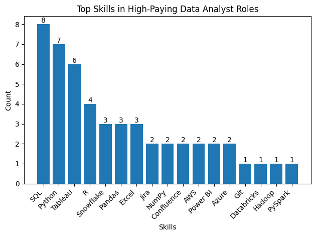
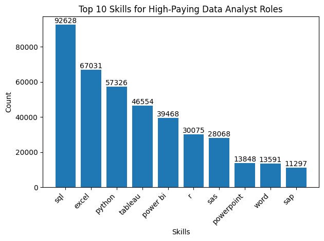
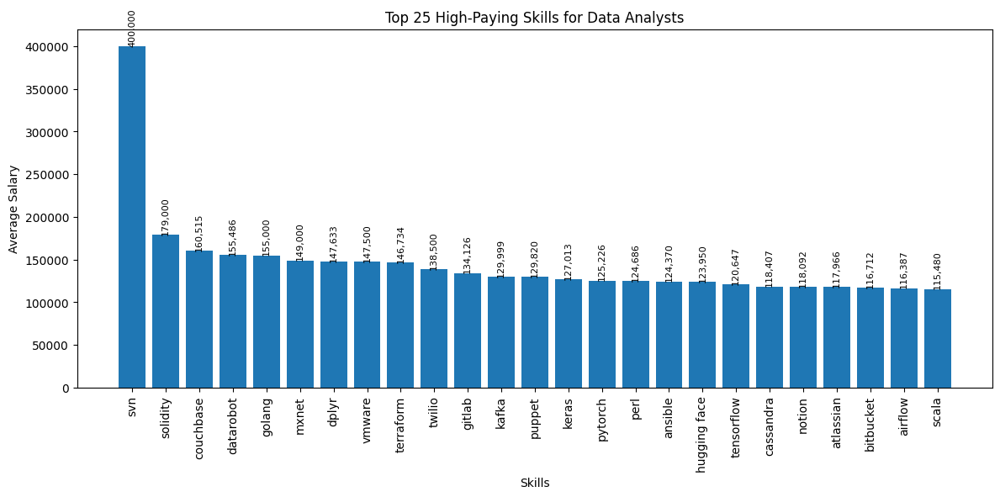
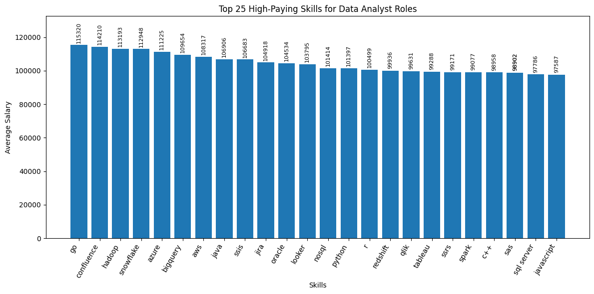

# Introduction
📊 SQL Project: Analysis of Top-Paying Data Analyst Jobs & Skills

This SQL project focuses on analyzing top-paying and high-demand Data Analyst job roles by exploring real-world job posting data. The goal is to uncover salary trends, in-demand skills, and skill–salary relationships that define the modern Data Analyst market.

- 🔍 Project Overview
SQL queries? Check them out: [SQL_Projects](/SQL_Projects/)
# Background

Driven by a quest to navigate the data analyst job market more effectively, this project was born from a desire to pinpoint top-paid and in-demand skills, streamlining others work to find optimal jobs.

### The questions to be answered through my SQL queries were:

1. What are the top-paying data analyst jobs?
2. What skills are required for these top-paying jobs?
3. What skills are most in demand for data analysts?
4. Which skills are associated with higher salaries?
5. What are the most optimal skills to learn?

# Tools I used
For my deep dive into the data analyst job market, I harnessed the power of several key tools:

 - **SQL**: The backbone of my analysis, allowing me to query the database and unearth critical insights.

 - **PostgreSQL**: The chosen database management system, ideal for handling the job posting data.

 - **Visual Studio Code**: My go-to for database management and executing SQL queries.

 - **Git & GitHub**: Essential for version control and sharing my SQL scripts and analysis, ensuring collaboration and project tracking.
# The Analysis
Each query for this project aimed at investigating specific aspects of the data analyst job market.
Here's how I approached each question:

### 1. Top Paying Data Analyst Jobs

Identifying the top 10 highest-paying Data Analyst roles that are available remotely.Focuses on job postings with specified salaries.
``` SQL
SELECT
    job_id,
    job_title,
    Company_details.name AS comapany_name,
    job_location,
    job_schedule_type,
    salary_year_avg,
    job_posted_date
FROM
    job_postings_fact
LEFT JOIN company_dim AS Company_details
    ON job_postings_fact.company_id = Company_details.company_id
WHERE
    job_title_short = 'Data Analyst' AND 
    job_location = 'Anywhere' AND
    salary_year_avg IS NOT NULL
ORDER BY
    salary_year_avg DESC
LIMIT 10    
```
Analysis Breakdown:

 - **Seniority** = pay multiplier :Top salaries are concentrated in Director and Principal-level analytics roles, showing leadership and strategic ownership drive compensation more than technical execution alone.

 - **“Data Analyst” can still mean $200k+** :The same job title spans a huge pay range (up to $650k), proving salary depends on impact, specialization, and responsibility, not the title itself.

 - **Remote analytics roles pay top dollar** :All roles are full-time and location-agnostic, confirming that high-paying analytics jobs are now remote-first, not location-bound.

### 2. Skills for Top Paying Jobs

Figuring out top 10 highest-paying Data Analyst jobs with the specific skills required for those roles. 

It provides a detailed look at which high-paying jobs demand certain skills,to understand which skills to develop that align with top salaries.

```SQL
WITH top_job AS (
SELECT
    job_id,
    job_title,
    company_dim.name AS company_name,
    salary_year_avg
FROM
    job_postings_fact 
LEFT JOIN company_dim
    ON job_postings_fact.company_id = company_dim.company_id
WHERE
    job_title_short = 'Data Analyst' AND 
    job_location = 'Anywhere' AND
    salary_year_avg IS NOT NULL
ORDER BY
    salary_year_avg DESC
LIMIT 10
)
SELECT
    top_job.*,
    skills
FROM top_job
INNER JOIN skills_job_dim ON top_job.job_id = skills_job_dim.job_id
INNER JOIN skills_dim ON skills_dim.skill_id =skills_job_dim.skill_id
```



Analysis Breakdown:

 - SQL & Python lead – Core, non-negotiable skills for top-paying Data Analyst roles.

 - **Visualization matters** – Tableau and Power BI are key for business-driven insights.

 - **Cloud skills boost pay** – Snowflake, AWS, Azure, and Databricks are strongly linked to higher salaries.

 - **Advanced analytics adds edge** – Pandas, NumPy, R, and Jupyter enable deeper analysis and automation.

 - **Engineering mindset required** – Git, Jira, and Confluence reflect collaboration and production-ready workflows.

### 3.In Demand Skill for Data Analyst

Identify the top 10 in-demand skills for a data analyst. Focus on all job postings. Retrieves the top 10 skills with the highest demand in the job market.

```SQL
SELECT
    skills,
    COUNT(skills_job_dim.job_id) AS skill_count
FROM job_postings_fact
INNER JOIN skills_job_dim ON job_postings_fact.job_id = skills_job_dim.job_id
INNER JOIN skills_dim ON skills_job_dim.skill_id = skills_dim.skill_id
WHERE
    job_title_short = 'Data Analyst'
GROUP BY
    skills
ORDER BY
    skill_count DESC
LIMIT 10
```


Analysis Breakdown:

 - **SQL is non-negotiable** – it is the single most important skill for high-paying Data Analyst roles.

 - **Excel is still powerful** – even at top salary levels, strong Excel skills remain relevant.

 - **Python is a career accelerator** – roles paying more expect automation, scripting, and advanced analysis.

 - **Visualization tools drive impact** – Tableau and Power BI are key for translating data into decisions.

 - **Business context matters** – presentation and enterprise tools (PowerPoint, SAP) signal analyst-to-stakeholder influence

### 4. Skills Based on Salary

What are the top skills based on salary? Look at the average salary associated with each skill for Data Analyst positions.

```SQL
SELECT
    skills,
    --COUNT(skills_job_dim.job_id) AS skill_count,
    ROUND(AVG (job_postings_fact.salary_year_avg),0) AS avg_salary
FROM job_postings_fact
INNER JOIN skills_job_dim ON job_postings_fact.job_id = skills_job_dim.job_id
INNER JOIN skills_dim ON skills_job_dim.skill_id = skills_dim.skill_id
WHERE
    job_title_short = 'Data Analyst' AND
    salary_year_avg IS NOT NULL
GROUP BY
    skills
ORDER BY
    avg_salary DESC
LIMIT 25
```


Analysis Breakdown:
 - **Big Data & ML skills drive top pay** – PySpark, Couchbase, DataRobot, and Python libraries (Pandas, NumPy) are highly valued for scalable analytics and predictive modeling.

 - **Data + engineering crossover pays more** – Tools like GitLab, Kubernetes, and Airflow highlight demand for automation and production-ready data pipelines.

 - **Cloud expertise boosts salaries** – Databricks, Elasticsearch, and GCP reflect the shift toward cloud-native analytics environments.

 ### 5.Most Optimal Skill to learn

The most optimal skills to learn (high demand and high-paying skill). Identifying skills in high demand and associated with high average salaries for Data Analyst roles concentrates on remote positions with specified salaries.

```sql
WITH top_skills AS (
    SELECT
        skills_dim.skill_id,
        skills_dim.skills,
        COUNT(skills_job_dim.job_id) AS skill_count
    FROM job_postings_fact
    INNER JOIN skills_job_dim ON job_postings_fact.job_id = skills_job_dim.job_id
    INNER JOIN skills_dim ON skills_job_dim.skill_id = skills_dim.skill_id
    WHERE
        job_title_short = 'Data Analyst'AND
        salary_year_avg IS NOT NULL AND
        job_work_from_home = True
    GROUP BY
        skills_dim.skill_id
),avg_salary_skill AS(
    SELECT
        skills_job_dim.skill_id,
        ROUND(AVG (job_postings_fact.salary_year_avg),0) AS avg_salary
    FROM job_postings_fact
    INNER JOIN skills_job_dim ON job_postings_fact.job_id = skills_job_dim.job_id
    INNER JOIN skills_dim ON skills_job_dim.skill_id = skills_dim.skill_id
    WHERE
        job_title_short = 'Data Analyst' AND
        salary_year_avg IS NOT NULL AND
        job_work_from_home = True
    GROUP BY
        skills_job_dim.skill_id
)
SELECT
    top_skills.skill_id,
    top_skills.skills,
    top_skills.skill_count,
    avg_salary_skill.avg_salary
FROM
    top_skills
INNER JOIN avg_salary_skill 
    ON top_skills.skill_id = avg_salary_skill.skill_id
WHERE 
    skill_count >10
ORDER BY
    avg_salary DESC,
    skill_count DESC
LIMIT 25
```


Analysis Breakdown:

 - **Cloud & data platform skills** pay above average with strong demand Skills like Snowflake, Azure, AWS, BigQuery, Redshift combine solid posting counts with $105k–$113k avg salaries, showing companies pay a premium for analysts who work directly on cloud data warehouses.
 - **Programming + big data skills** unlock salary upside Go, Hadoop, Spark, Java, Python consistently push salaries above or around $100k, especially when paired with large-scale data processing — signaling a shift toward analytics + engineering hybrid roles.
 - **Core analytics tools** remain highly demanded, but cap salary Tools like Python, R, Tableau, Looker, SQL Server appear most frequently, but salaries cluster around $98k–$103k, meaning they’re essential for entry and mid-level roles but not strong differentiators for top pay.

# What I learned

Throughout this learning experience as I got the better at  

 - Complex Quering
 - Database & Table Exploration
 - Data Filtering & Sorting
 - Aggregation & Grouping
 - Joins & Relationships
 - Subqueries & CTEs
 - Real-World Data Analysis
 
 This Project enabled me to move beyond basic querying and confidently analyze databases using SQL, apply advanced query logic, and prepare datasets for reporting and decision-making.

# Conclusion

1. **Top-Paying Data Analyst Jobs**: The highest-paying jobs for data analysts that allow remote work offer a wide range of salaries, the highest at $650,000!

2. **Skills for Top-Paying Jobs**: High-paying data analyst jobs require advanced proficiency in SQL, suggesting it's a critical skill for earning a top salary.

3. **Most In-Demand Skills**: SQL is also the most demanded skill in the data analyst job market, thus making it essential for job seekers.

4. **Skills with Higher Salaries**: Specialized skills, such as SVN and Solidity, are associated with the highest average salaries, indicating a premium on niche expertise.

5. **Optimal Skills for Job Market Value**: SQL leads in demand and offers for a high average salary, positioning it as one of the most optimal skills for data analysts to learn to maximize their market value.

### Closing Thoughts

This project strengthened my SQL skills while uncovering valuable insights into the data analyst job market.  By focusing on high-demand, high-paying skills, aspiring data analysts can better position themselves in a competitive market. Overall, the project emphasizes the importance of continuous learning and adapting to evolving trends in data analytics.
